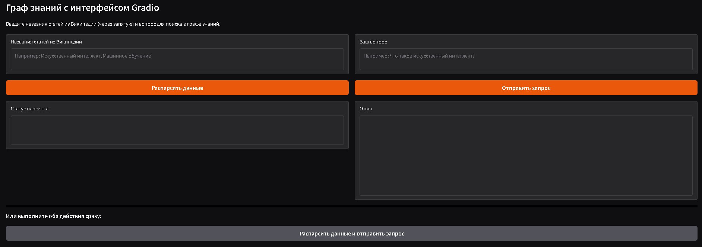

# Граф знаний с интерфейсом Gradio

<div align="center">

**Интерактивный веб-интерфейс для работы с графом знаний на основе статей из Википедии**



</div>

---

## Описание

Этот проект представляет собой интерактивное приложение для построения и использования графов знаний на основе статей из Википедии. Приложение использует русскоязычные языковые модели от SberDevice и предоставляет удобный веб-интерфейс через Gradio.

### Что такое граф знаний?

Граф знаний — это структурированное представление информации в виде узлов (сущностей) и связей (отношений) между ними. В отличие от векторных баз данных, графы знаний позволяют:

- Сохранять семантические связи между понятиями
- Выполнять сложные логические запросы
- Снижать вероятность галлюцинаций в LLM
- Предоставлять более точные и структурированные ответы

---

## Возможности

- **Автоматический парсинг статей** из русскоязычной Википедии
- **Построение графа знаний** с использованием LlamaIndex
- **Интерактивный интерфейс** на базе Gradio
- **Интеграция с русскоязычными моделями** от SberDevice
- **Визуализация связей** между сущностями
- **Семантический поиск** по графу знаний
- **Оптимизация памяти** через квантование моделей

---

## Использование

### Запуск приложения

1. Откройте файл `knowledge_graph_gradio.ipynb` в Jupyter Notebook или [Google Colab](https://colab.research.google.com/drive/17g40FRChGVNMdOMtwCmWLSPZd15iWfjy?usp=sharing)
2. Запустите все ячейки последовательно
3. После выполнения последней ячейки откроется веб-интерфейс Gradio

### Работа с интерфейсом

#### Шаг 1: Парсинг данных из Википедии

1. В поле **"Названия статей из Википедии"** введите названия статей через запятую:
   ```
   Искусственный интеллект, Машинное обучение, Нейронная сеть
   ```

2. Нажмите кнопку **"Распарсить данные"**

3. Дождитесь сообщения об успешном построении графа знаний

#### Шаг 2: Запрос к графу знаний

1. В поле **"Ваш вопрос"** введите интересующий вас вопрос:
   ```
   Что такое искусственный интеллект?
   ```

2. Нажмите кнопку **"Отправить запрос"**

3. Ответ появится в поле **"Ответ"**

#### Комбинированный режим

Используйте кнопку **"Распарсить данные и отправить запрос"** для выполнения обоих действий сразу.

---

## Архитектура проекта

```
knowledge_graph_gradio.ipynb
│
├── Установка зависимостей
│   └── Установка всех необходимых библиотек
│
├── Импорт библиотек
│   ├── LlamaIndex (граф знаний)
│   ├── HuggingFace (модели)
│   ├── Gradio (интерфейс)
│   └── WikipediaReader (парсинг)
│
├── Настройка модели
│   ├── Выбор русскоязычной модели
│   ├── Настройка квантования
│   └── Инициализация LLM
│
├── Вспомогательные функции
│   ├── messages_to_prompt()
│   └── completion_to_prompt()
│
├── Функции графа знаний
│   ├── parse_wikipedia_and_build_graph()
│   └── query_knowledge_graph()
│
└── Gradio интерфейс
    ├── Поля ввода
    ├── Кнопки действий
    └── Области вывода
```

---

## Настройка модели

### Доступные модели

Проект поддерживает различные русскоязычные модели:

1. **ai-forever/rugpt3large_based_on_gpt2** (по умолчанию)
   - Базовая русскоязычная модель GPT-3
   - Хорошо работает для общих задач

2. **sberbank-ai/rugpt3large_based_on_gpt2**
   - Альтернативная версия от SberBank

3. **IlyaGusev/saiga_mistral_7b**
   - Более мощная модель на базе Mistral
   - Требует токен HuggingFace

### Изменение модели

Чтобы использовать другую модель, измените переменную `MODEL_NAME` в ячейке настройки:

```python
MODEL_NAME = "IlyaGusev/saiga_mistral_7b"  # Ваша модель
```

---

## Технические детали

### Используемые технологии

- **LlamaIndex**: Фреймворк для работы с графами знаний
- **HuggingFace Transformers**: Загрузка и использование языковых моделей
- **Gradio**: Создание веб-интерфейса
- **Wikipedia API**: Получение статей из Википедии
- **BitsAndBytes**: Квантование моделей для оптимизации памяти

### Параметры графа знаний

- **max_triplets_per_chunk**: 3 (количество триплетов на блок текста)
- **chunk_size**: 512 (размер блока текста)
- **include_embeddings**: True (включение векторных вложений)

### Параметры генерации

- **max_new_tokens**: 512
- **temperature**: 0.7
- **top_p**: 0.9
- **do_sample**: True

---

## Решение проблем

### Проблема: Модель не загружается

**Решение:**
- Проверьте подключение к интернету
- Убедитесь, что у вас достаточно памяти (рекомендуется GPU)
- Попробуйте другую модель из списка доступных

### Проблема: Ошибка при парсинге Википедии

**Решение:**
- Проверьте правильность написания названий статей
- Убедитесь, что статьи существуют в русскоязычной Википедии
- Попробуйте использовать точные названия статей

### Проблема: Недостаточно памяти

**Решение:**
- Используйте квантование модели (уже включено по умолчанию)
- Уменьшите количество статей для обработки
- Используйте более легкую модель

---

## Лицензия

Этот проект создан в образовательных целях. Используйте на свое усмотрение.

---

## 📚 Полезные ссылки

- [LlamaIndex Documentation](https://docs.llamaindex.ai/)
- [Gradio Documentation](https://www.gradio.app/docs/)
- [HuggingFace Models](https://huggingface.co/models)
- [Wikipedia API](https://www.mediawiki.org/wiki/API:Main_page)

---

<div align="center">

**Сделано с ❤️ для изучения графов знаний**

⭐ Если проект был полезен, поставьте звезду!

</div>

